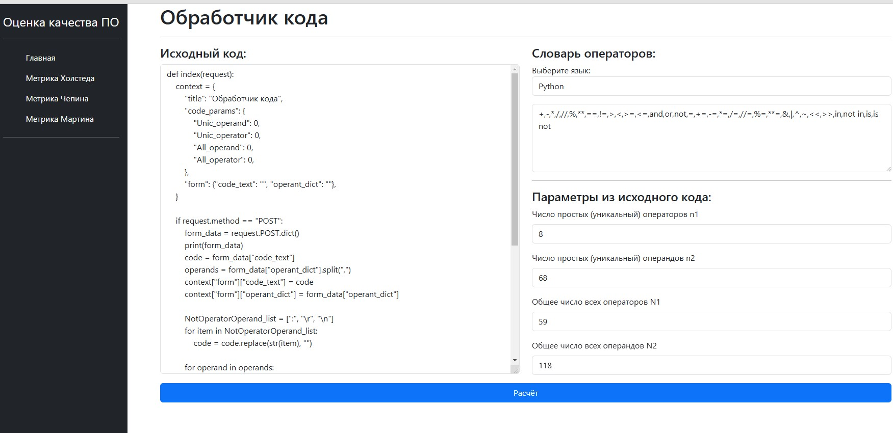
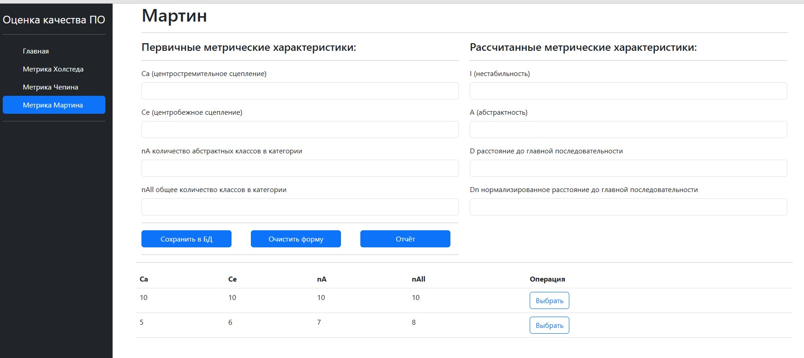
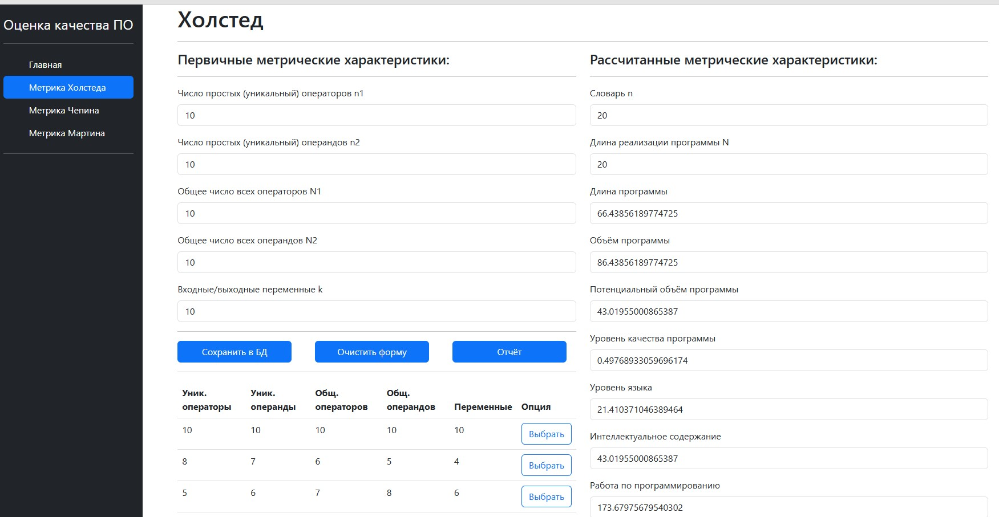
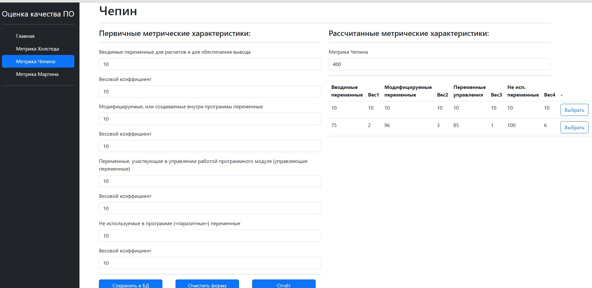

# SoftwareQuality

**SoftwareQuality** — это Django-приложение для оценки качества программного кода с использованием метрик Чепина, Холстеда и Мартина. Оно позволяет анализировать исходный код и получать количественные оценки его сложности, поддерживаемости и качества.

---

## Основные функции

- **Метрика Чепина:** Оценка сложности программы на основе количества уникальных операторов и операндов.
- **Метрика Холстеда:** Анализ объема и сложности кода с использованием параметров, таких как количество операторов и операндов.
- **Метрика Мартина:** Оценка связности и связности модулей в объектно-ориентированном коде.

---
## Запуск проекта

### Локальный запуск

1. **Установите зависимости**:
   Убедитесь, что у вас установлен Python 3.10. Затем выполните следующие команды:
   ```bash
   # Клонируйте репозиторий
   git clone https://github.com/yourusername/software_quality_assessment.git
   cd software_quality_assessment

   # Создайте виртуальное окружение
   python -m venv venv

   # Активируйте виртуальное окружение
   # Для Windows:
   venv\Scripts\activate
   # Для macOS/Linux:
   source venv/bin/activate

   # Установите зависимости
   pip install -r requirements.txt
   ```
2. **Настройте базу данных**:
   По умолчанию используется SQLite. Если вы хотите использовать другую базу данных, измените настройки в settings.py:
   ```python
   DATABASES = {
      'default': {
         'ENGINE': 'django.db.backends.sqlite3',
         'NAME': BASE_DIR / 'db.sqlite3',
       }
   }
   ```

   Примените миграции:
   ```bash
   python manage.py migrate
   ```
3. **Запустите сервер разработки**:
   Запустите сервер разработки:
   ```bash
   python manage.py runserver
    ```
   Перейдите по адресу http://127.0.0.1:8000/, чтобы открыть приложение.

### Запуск через Docker Compose 
1. Убедитесь, что Docker и Docker Compose установлены:
   - Установите Docker: https://docs.docker.com/get-docker/
   - Установите Docker Compose: https://docs.docker.com/compose/install/
3. Клонируйте репозиторий:
   ```bash
   git clone https://github.com/yourusername/software_quality_assessment.git
   cd software_quality_assessment
   ```
5. Запустите проект через Docker Compose:
   ```bash
   docker-compose up --build
   ```
7. После успешного запуска перейдите по адресу http://localhost:8000/.
8. Чтобы остановить контейнеры, выполните:
   ```bash
   docker-compose down
   ```
## Интерфейс приложения

### 1. Главная страница
После нажатия кнопки "Расчет" отображаются результаты анализа, включая словарь операндов и параметры кода.


*Рисунок 1: Результаты анализа исходного кода.*

---

### 2. Метрика Мартина
На вкладке "Метрика Мартина" можно загрузить данные и получить метрические характеристики.


*Рисунок 2: Вкладка с метрикой Мартина.*

---

### 3. Метрика Холстеда
На вкладке "Метрика Холстеда" можно загрузить данные и получить первичные метрические характеристики.


*Рисунок 3: Вкладка с метрикой Холстеда.*

---

### 4. Метрика Чепина
На вкладке "Метрика Чепина" можно загрузить данные и получить метрические характеристики.


*Рисунок 4: Вкладка с метрикой Чепина.*
   
